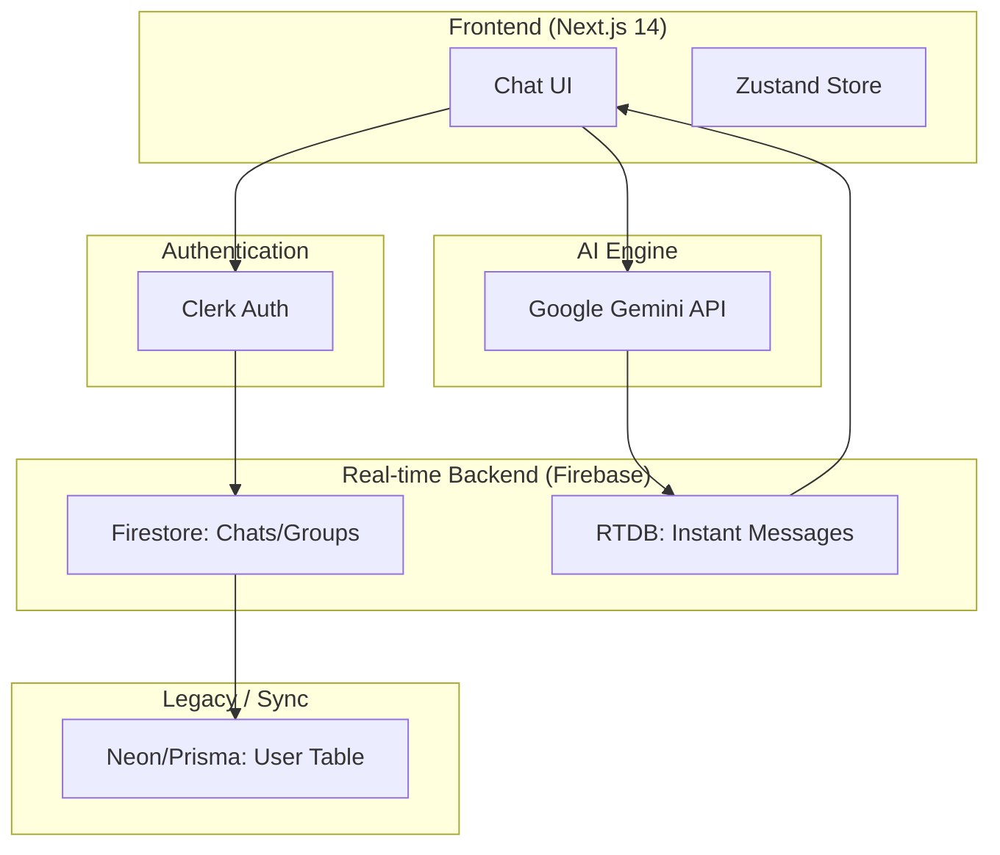
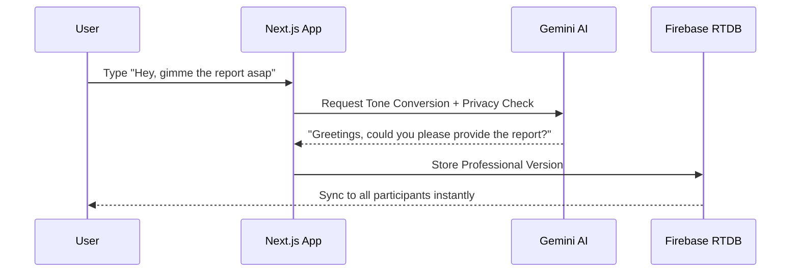

# 🚀 AI Chat App with Privacy Filters [](https://chat-app-ai-main.vercel.app/)

Real-time chat platform featuring **AI-powered tone conversion** and **stealth privacy protection**. Built with a serverless-first architecture for high scalability and professional communication.

---

## 🧩 Project Overview
This platform ensures secure, professional internal communication by leveraging **Google Gemini AI** to automatically refine message tones while protecting sensitive user data through advanced privacy filters.

---

## 🛰️ Architecture


---

## 🚀 Quick Start

### 1. Clone & Install
```bash
git clone https://github.com/Shourya2803/chat-app.git
cd chat-app
npm install
```

### 2. Configure Environment
```bash
cp .env.example .env.local
```
*Fill in your Clerk, Firebase, and Gemini credentials (see [Environment Setup](#️-environment-setup)).*

### 3. Run Locally
```bash
npm run dev
```
Access at: `http://localhost:3000/chat`

---

## 📱 Features
- ✅ **Real-time Messaging**: Sub-second sync via Firebase Realtime Database.
- ✅ **AI Professional Tone**: Casual chat transforms into corporate-ready text instantly.
- ✅ **Stealth Privacy**: Auto-detection and masking of phone numbers and emails.
- ✅ **Group Management**: Seamless creation and discovery of global/private groups.
- ✅ **Mobile Responsive**: Fully optimized UI for seamless mobile experience.
- ✅ **Secure Auth**: Enterprise-grade security with Clerk + Firebase sync.

---

## ⚙️ Environment Setup

| Service | Keys Needed |
|---------|-------------|
| **Clerk** | `NEXT_PUBLIC_CLERK_PUBLISHABLE_KEY`, `CLERK_SECRET_KEY` |
| **Firebase** | `NEXT_PUBLIC_FIREBASE_API_KEY`, `FIREBASE_PROJECT_ID`, `FIREBASE_PRIVATE_KEY` |
| **Google AI** | `GEMINI_API_KEY` |
| **Storage** | `CLOUDINARY_URL` or S3 credentials |

---

## 🔒 Privacy Features & AI Transform

### **AI Tone Conversion**
The AI converts aggressive or casual tones into professional language:
> **Input:** "looser you are, where is my work?"
>
> **Output:** "Valued colleague, could you please provide a status update on the pending tasks?"

### **Data Obfuscation**
- **Phone Numbers**: Automatically detected and replaced with *"Please contact through this platform for security"* (the sender is unaware of the block).
- **Emails**: `srmm@gmail.com` is automatically converted to obfuscated links like `[srmm@mail.com]`.

---

## 📈 Message Flow Diagram



---

## 🚀 Production Deploy
This app is optimized for **Vercel**:
1. Connect GitHub Repository.
2. Add Environment Variables.
3. **Critical**: Ensure `FIREBASE_PRIVATE_KEY` is formatted correctly with `\n` characters.
4. Deploy and enjoy serverless real-time AI chat!

---

## 📊 Screenshots
| [Chat UI Mobile] | [Group Creation] | [AI Transformation] |
|-----------------|------------------|--------------------|
|  |  |  |

---

## 🛠️ Local Development Commands
- `npm run dev`: Start development server.
- `npx prisma generate`: Update local Prisma client.
- `npm run build`: Production build and Prisma sync.

---

*Built with ❤️ by [Shourya](https://github.com/Shourya2803)*
